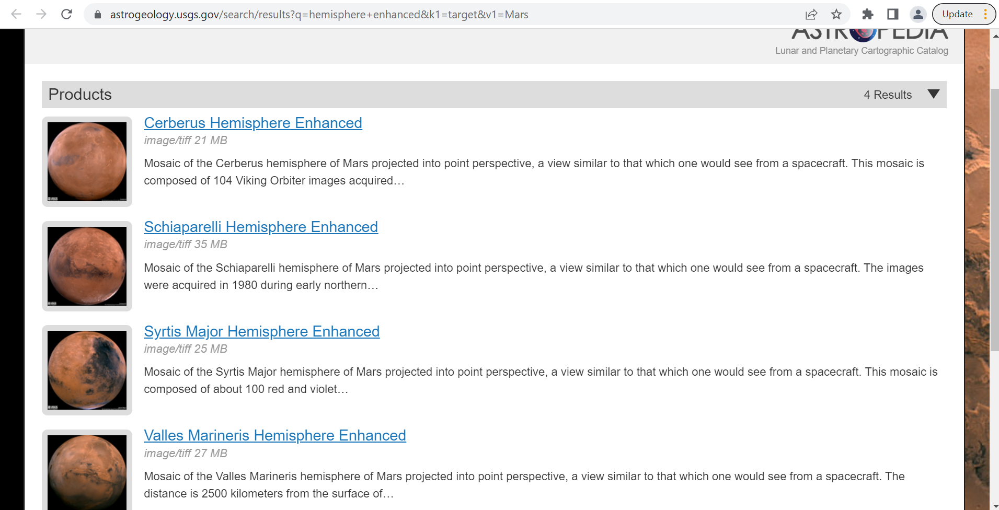

# Mission-to-Mars

## Project Overview

The purpose of this project is to build a Web App that will scrape several websites for the most recent Mars data. The extracted data is stored in a NoSQL database and then an HTML page is created to display the findings.

## Challenge Goals
1. Using BeautifulSoup and Splinter, you’ll scrape full-resolution images of Mars’s hemispheres and the titles of those images.
2. Update the Web App with Mars Hemisphere Images and Titles.
3. Update your web app to make it mobile- responsive, and add two additional Bootstrap 3 components to make it stand out.

